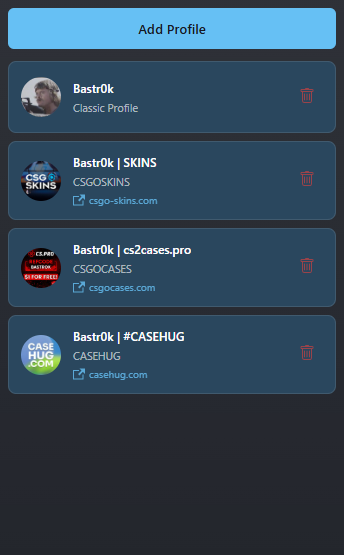

    <h1>Steam Account Changer</h1>

 

## :notebook: Description :notebook:

Cette extension Chrome a été créée pour permettre aux utilisateurs de Steam de changer rapidement entre différents profils prédéfinis. Elle offre une interface intuitive et moderne pour gérer vos configurations de profil Steam.

## :sparkles: Fonctionnalités :sparkles:

* Stockage local des paramètres de profil
* Changement rapide entre les noms et images de profil Steam
* Interface utilisateur intuitive
* Thème sombre inspiré de Steam
* Animations et transitions fluides
* Design responsive avec taille de popup fixe (360x580px)

## :cd: Installation :cd:

1. Ouvrez Chrome et accédez à `chrome://extensions/`
2. Activez le "Mode développeur" en haut à droite
3. Cliquez sur "Charger l'extension non empaquetée"
4. Sélectionnez le dossier contenant les fichiers de l'extension

## :gear: Utilisation :gear:

1. Cliquez sur l'icône de l'extension dans la barre d'outils Chrome
2. Cliquez sur le bouton "+" pour ajouter un nouveau profil
3. Remplissez le formulaire avec :
   - Nom du site web
   - Nom du profil
   - URL de l'image du profil
   - URL du site web (optionnel)
4. Cliquez sur "Enregistrer"
5. Pour utiliser un profil, cliquez simplement sur son bouton

## :warning: Notes :warning:

* L'extension nécessite un accès à steamcommunity.com pour fonctionner
* Assurez-vous d'être connecté à Steam avant d'utiliser l'extension
* Toutes les données de profil sont stockées localement dans votre navigateur

## :camera_flash: Captures d'écran :camera_flash:

* Interface de l'extension :
     
    

